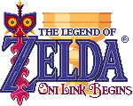

#  Zelda Oni Link Begins (v. 3.6)

It's a Russian translation of the Miyoo Mini port of [**Zelda - Oni Link Begins**](http://www.zeldaroth.fr/), a short and pleasant second fangame from Vincent Jouillat, and the sequel of Zelda Return of the Hylian. The original game was developed in C++ and was released in 2007.

Miyoo Mini Port by Vitty85 [source 1](https://archive.org/details/zelda-fan-game-ports-for-miyoo-mini-onion) and [source 2](https://www.reddit.com/r/MiyooMini/comments/18wnbgt/porting_of_zelda_fan_games/) based on Zelda OLB 3.6 version.

The thumbnail image, title logo and background are based on data files from [Zelda Oni Link Begins Solarus Edition](https://gitlab.com/solarus-games/games/zelda-olb-se) licensed under [Creative Commons Attribution-ShareAlike 4.0 (CC BY-SA 4.0)](http://creativecommons.org/licenses/by-sa/4.0/).